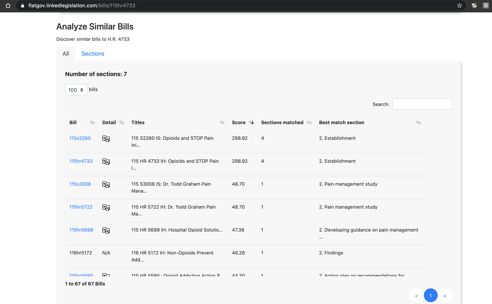

:toc:

# FlatGov: A https://demandprogress.org[Demand Progress] Project 
Utilities and applications for the FlatGov project by Demand Progress

A live demo of the application is https://flatgov.linkedlegislation.com[here]. These application documentation are also available there, at https://flatgov.linkedlegislation.com/static/docs/README.html When the documentation has been updated, it can be converted to html and copied to the application directory with the script `scripts/docs_generator has been updated, it can be converted to html and copied to the application directory with the script `scripts/docs_generator.sh` (requires installation of asciidoctor).

This repository contains:

* A web application showing information for a given bill (Django/Python)
* Utilities to scrape and process bill data (Python)

Both components are described below.

## Web Application Quickstart (development)

The FlatGov web application is built using the Django/Python web application framework. The application is contained in the `server_py` directory of this repository. It makes use of data that is processed using the scrapers and scripts described in the <<DATA_BACKGROUND.adoc#,DATA_BACKGROUND>>.

Below are instructions to set up a local development environment. For production deployment instructions, see <<DEPLOYMENT.adoc#,DEPLOYMENT>>.

### Clone this repository

```bash
$ git clone https://github.com/aih/FlatGov.git
$ cd FlatGov
```

### Install Python dependencies

Create a new Python virtual environment. You can use `venv`, `virtualenv` or preferably https://github.com/pyenv/pyenv-virtualenv[`pyenv virtualenv`], which requires installing https://github.com/pyenv/pyenv[pyenv] first).

If you don't have pyenv, try installing with homebrew
```bash
$ brew update
$ brew install pyenv
```

If you don't have pyenv-virtualenv, try installing with homebrew
```bash
$ brew install pyenv-virtualenv
```
Note: you may have to manually update `~/.bashrc` for virtual env commands to work

Create the environment (with pyenv virtualenv):
```bash
$ pyenv install 3.7
$ pyenv virtualenv 3.7 flatgov
```
Note: you may have to specify the patch version e.g. 3.7.9

Activate the environment
```bash
$ pyenv activate flatgov
```

Then load the `requirements.txt` into the virtual environment:

```bash
$ cd /path/to/FlatGov/server_py
$ pip install -r requirements.txt
```

### Create .env file 

Copy `server_py/flatgov/.env-sample` to `server_py/flatgov/.env`, and change the `SECRET_KEY` defined in that file.

### Database set-up

Use Django manage.py commands to download the data and populate the database (see <<DATABASE.adoc#,DATABASE>>).

### Data structure: the `Bill` model

The core of the application is a `bill`. This is described in <<BILL_MODEL.adoc#,BILL_MODEL>>, and the model itself is set up in Django in `server_py/flatgov/bills/models.py`. We model bills at the level of the `billnumber`, e.g. `116hr1500` is a bill in the 116th Congress, in the House of Representatives, bill number 1500. This bill may have many versions, which may differ significantly from each other (e.g the `Introduced` version may have just a few sections, while the `Reported in House` version has an entirely new thousand section bill substituted in its place). Where there are differences, we attempt to process the latest version of any bill (e.g to calculate bill similarity).

### Data: download bills with the https://github.com/unitedstates/congress[unitedstates/congress] scraper

To download and process data from earlier congresses, see details in <<DATA_BACKGROUND#, DATA_BACKGROUND>>. There are ~50Gb of data, total for Congresses 110-117, including processed json files, and `DATA_BACKGROUND`describes options for downloading and processing this data. For a 'quick start', you can use data from only the most recent Congress:

Download data from the most recent Congress
```bash
cd flatgov/uscongress
./run govinfo --bulkdata=BILLSTATUS --congress=117`
./run bills
```

NOTE: You may need to separately clone the `unitedstates/congress` repository, run the command from there, and link the `data` directory to a directory `congress/data` in this repository.

#### Celery task to update bill downloads and data

Updates to the data are done through the Celery taskrunner (see https://docs.celeryproject.org/en/stable/getting-started/introduction.html). Details of the tasks in Flatgov are in <<CELERY.adoc#, CELERY>>.

To run the Celery worker

```bash
$ pyenv activate flatgov
$ cd ~/.../FlatGov/server_py/flatgov 
$ celery worker -Q bill -A flatgov.celery:app -n flatgov.%%h --loglevel=info
```

Set up the Celery schedule
```bash
celery beat -S redbeat.RedBeatScheduler -A flatgov.celery:app --loglevel=info
```

#### Run the Django application

Run the application from `server_py/flatgov` (within the Python virtual environment you created above):

```bash
$ cd server_py/flatgov
$ python manage.py runserver
```

This will serve the application on localhost:8000. Pages for individual bills follow the form:
http://localhost:8000/bills/116hr1500

Bill-to-bill data pages are at:
`/bills/compare/115s211/115hr604/`

## Deployment

### Deployment instructions

Deployment instructions are in <<DEPLOYMENT.adoc#, DEPLOYMENT>>. The application is served on a Linux server (currently Ubuntu `Ubuntu 18.04.5 LTS` on AWS).

### System components

The components of the system are:

* Linux server on AWS (Ubuntu 18.04.5 LTS)
* Nginx web server
* Postgresql server (see <<DATABASE.adoc#,DATABASE>>)
* Elasticsearch server for search and bill similarity processing (see <<ES_SIMILARITY.adoc#,ES_SIMILARITY>>) 
* Python/Django application (this repository)
* uwsgi Python server running the Django application, proxied by Nginx above
* Bill metadata and xml, downloaded using scrapers from https://github.com/unitedstates/congress[unitedstates/congress]
* Scrapers: other data scraped from public sources, including: 

  -Statements of Administration Policy
  -Press statements
  -Congressional Budget Office reports
  -Congressional Research Service reports
  -Calendar information from various congressional sources

These are described in more detail in <<SCRAPING.adoc#, SCRAPING>>.

## Related Bills and Bill Similarity 

### Related bills

Bills that are related to each other are identified in two ways:

1. Metadata (in `billstatus` XML) from the Congressional Research Service identifies bills as `identical` or related (e.g through a Committee process). We show these in the `Related Bills` table of the application.
2. Same or similar titles. Two bills are considered related if they have exactly the same title, or differ only in the year (e.g. 'The Very Important Information Act of 2022' and 'The Very Important Information Act of 2023'). We process metadata to collect bill titles and show these bills in the `Related Bills` table.

### Bill similarity -- text similarity

#### Overview

* Bill-to-bill comparison is impractical

Calculating the `text` similarity between two bills may be relatively straightforward: we can find the percentage of overlapping text between the two bills. We may consider such a comparison for the `/compare` view of the application.

However, for a database of the size of this one, calculating the similarity of all bills is impractical, particularly if we want to update the data. The calculation requires approximately n^2^ comparisons, where n is the number of bills. For the ~80k bills in our corpus, this would be 6.4 billion comparisons.

* Search-based comparison

To improve performance, we use search. In particular, we search each section of the latest version of abill against an index of all bills, and combine the results of all of the section-wise searches to get a total score. We then have to filter results to remove duplicates (due to the different versions of all bills). 

This approach is imperfect, since many individual sections may share language with unrelated bills (e.g. an Effective Date provision). Smaller bills may not have enough text to reliably find the most relevant 'similar' bills. On the other hand, large bills may match many similar bills on a subset of sections.

This application sets up the basic mechanisms for similarity measurements (described further in <<ES_SIMILARITY.adoc#,ES_SIMILARITY>>), which are open to many refinements (e.g. with the similarity metric that is used in the comparison).

#### Finding Similar Bills 

As shown below, the application has three main views to explore bill similarity:

1. A list of similar bills, in order of similarity.
2. A section-by-section analysis of which other bills have similar sections.
3. A bill-to-bill comparision showing matching sections between two bills.

Note that small sections with common language will *not* show as matches using our methodology. We will only show sections that use distinct language, where that language is shared between sections of the two bills.

.Similar Bills
[#img-similar-bills]
[caption="Figure 1: " ]


.Section-by-section List
[#img-similarity-by-section]
[caption="Figure 2: " ]
image::media/bill-similarity-by-section-115hr4733.png[SectionBySectionBills,300,200]

.Bill-to-bill Similarity 
[#img-bill-to-bill-similarity]
[caption="Figure 3: " ]
image::media/bill-similarity-compare.png[BilltoBillSimilarity,300,200]

.Text-to-bill Similarity 
[#img-text-to-bill-similarity]
[caption="Figure 4: " ]
image::media/bill-similarity-text-search.png[TextToBillSimilarity,300,200]


## Relevant Committee Documents

To load Relevant Committee Documents data use the following instructions:


1. After installing the requirements under scrapers directory, run crec_scrape_urls.py file under scrapers directory.
2. Go to the crec_scrapy folder and run “scrapy crawl crec”  command. It will take about an hour to scrape all the data in crec_scrapy/data/crec_data.json file.
3. Copy scraped data from crec_scrapy/data/crec_data.json to django base directory. First delete old data under django base directory or replace it.
4. Run django command “./manage.py load_crec” command to populate the data to the database.